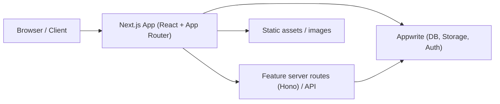
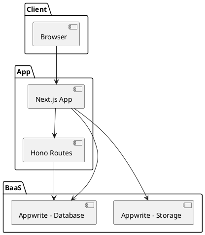
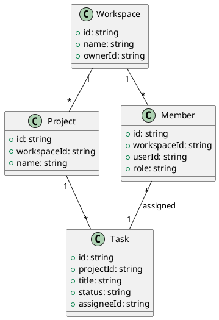
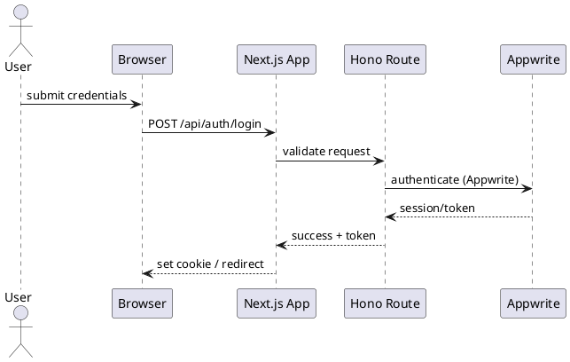
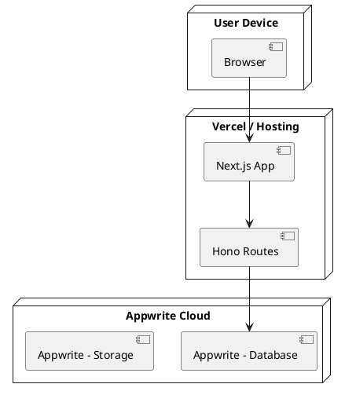
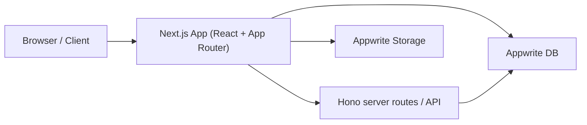
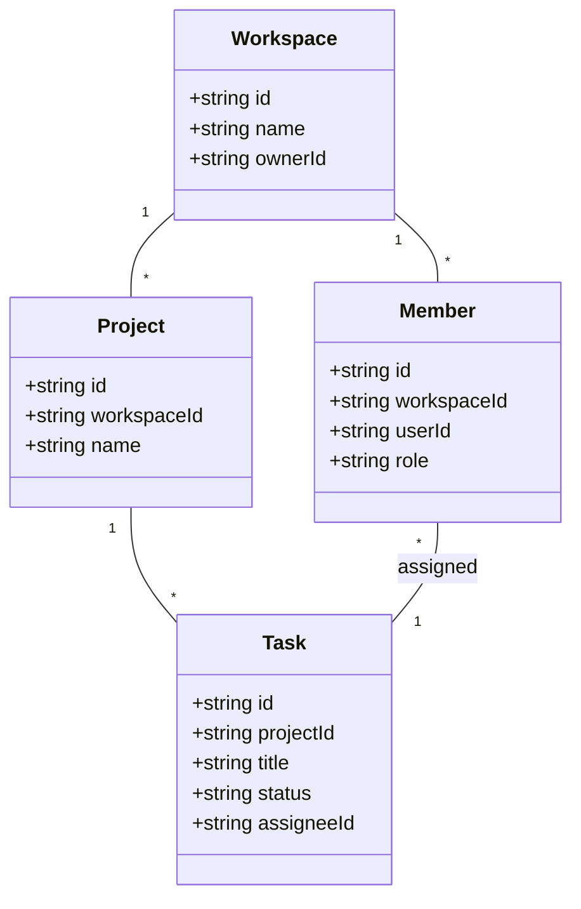
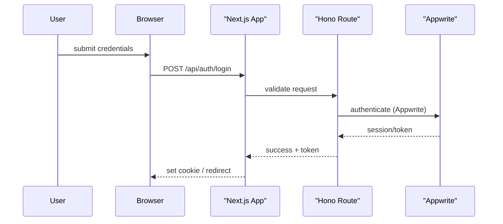
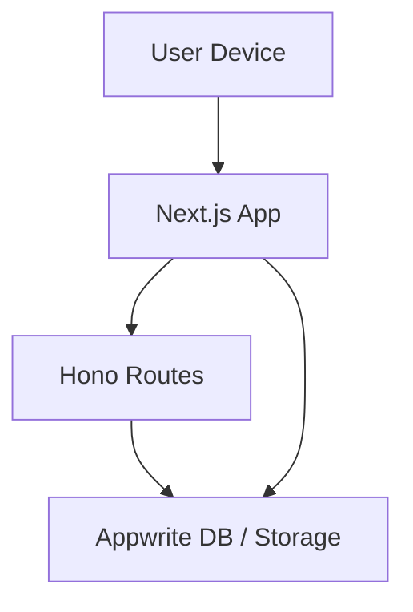

## Project Report — Gojira (jira-clone-nextjs)

Generated: 2025-10-29

---

## 1. Title & Basic Info
- Project name: jira-clone-nextjs (package name: `jira-clone-nextjs`)
- Version: 0.1.0
- Repo title (from README): Gojira
- Primary purpose: Full-stack task / project management application (Jira-like) with workspaces, projects, tasks, kanban/table/calendar views and member collaboration.

## 2. One-line Description
A Next.js 14 + TypeScript clone of Jira (Gojira) built with TailwindCSS, Appwrite backend, Hono for server routes, and shadcn-style UI primitives — offering workspaces, projects, members, and multi-view task management.

## 3. Tech Stack
- Framework: Next.js 14 (App Router)
- Language: TypeScript
- UI: React 18, Tailwind CSS v3, shadcn UI patterns, Radix primitives
- Backend / BaaS: Appwrite (client: `node-appwrite`)
- Server helpers: Hono (with zod validator)
- Data fetching / state: @tanstack/react-query
- Drag & Drop: @hello-pangea/dnd
- Calendar & date: react-big-calendar, react-day-picker, date-fns
- Forms & validation: react-hook-form, zod, @hookform/resolvers
- Charts: recharts
- Icons: lucide-react, react-icons, @radix-ui packages
- Notifications: sonner
- Tooling: Tailwind, PostCSS, ESLint, TypeScript
- Runtime / package manager: README suggests Bun (but `package.json` scripts use Next CLI — Node.js or Bun both can run this)

## 4. Architecture (high-level)
Client (Next.js app router) ⇄ Appwrite (database + storage + auth)

Mermaid (simple):



Notes: Appwrite hosts project data: workspaces, members, projects, tasks and image storage. The app uses both client SDK calls and server routes (see `src/features/*/server` and `src/app/api/[[...route]]/route.ts`).

## 5. Folder structure (key folders)
- `src/app/` — Next.js App Router entry: layouts and pages
  - `(auth)` — sign-in / sign-up
  - `(dashboard)` — main dashboard and workspace pages
  - `(standalone)` — standalone workspace pages (create/view)
  - `api/`, `oauth/` — server routes
- `src/components/` — shared UI and `ui/` primitives (buttons, inputs, dialogs, etc.)
- `src/features/` — domain features: `auth`, `workspaces`, `projects`, `tasks`, `members` (client hooks, components, server routes)
- `src/lib/` — utilities and wrappers (Appwrite client, oauth helpers, middleware, rpc)
- `src/hooks/` — custom hooks
- `public/` — static assets

This structure follows a feature-driven approach with composite layouts supplied by the Next App Router.

## 6. Important config files
- `package.json` — scripts and dependency list
- `next.config.mjs` — image remotePatterns for Appwrite storage
- `tsconfig.json` — strict TypeScript settings and path aliases (`@/*` → `./src/*`)
- `tailwind.config.ts` — content paths, dark mode, custom theme tokens and plugin
- `src/config.ts` — environment-backed constants for Appwrite resource IDs

## 7. Dependencies (high-level)
- UI & primitives: `@radix-ui/*`, `lucide-react`, `react-icons`
- Data / state: `@tanstack/react-query`, `@tanstack/react-table`
- Backend: `node-appwrite`, `hono`
- DND & calendar: `@hello-pangea/dnd`, `react-big-calendar`, `react-day-picker`
- Validation & forms: `zod`, `react-hook-form`, `@hookform/resolvers`
- Misc: `clsx`, `class-variance-authority`, `sonner`, `tailwind-merge`

For exact versions, consult `package.json`.

## 8. UML diagrams — what to create and how

Purpose: provide clear architectural and behavioral documentation for developers and stakeholders. The recommended set of UML/architecture diagrams for this project are:

- Component diagram (system-level components and integrations)
- Class / Data Model diagram (Appwrite collections & main domain models)
- Sequence diagrams (key flows: authentication, task creation, task assignment)
- Activity diagram (task lifecycle: open → in-progress → review → done)
- Deployment diagram (runtime topology: client, Next.js app, server routes, Appwrite services)

Recommended tools:

- PlantUML (file-based, good for PNG/SVG export and source-controlled diagrams)
- Mermaid (Markdown-friendly; ideal for quick inline diagrams in docs)
- draw.io / diagrams.net (visual editor for hand-crafted diagrams)
- VS Code extensions: "PlantUML" and "Markdown Preview Enhanced" (Mermaid support)

Where to store diagrams:

- Create a `diagrams/` folder at the repo root. Keep source files (`.puml`, `.mmd`) and generated images (`.png`, `.svg`) there. Commit sources; add generated images if desired.

PlantUML quick setup & generation (local):

1) Download PlantUML jar and Graphviz, or use Docker.

2) Example commands (PowerShell):

```powershell
# If you have plantuml.jar and Java installed (generate PNG for all .puml files)
# Download plantuml.jar to tools/plantuml/plantuml.jar
java -jar .\tools\plantuml\plantuml.jar -tpng .\diagrams\*.puml

# Or, using Docker (bind-mount current repo into container)
# Replace ${PWD} with the workspace path in PowerShell
docker run --rm -v ${PWD}:/work plantuml/plantuml -tpng /work/diagrams/*.puml
```

PlantUML examples

1) Component diagram (save as `diagrams/component.puml`):



2) Class / Data model diagram (save as `diagrams/class-data-model.puml`):



3) Sequence diagram: Sign-in (save as `diagrams/sequence-signin.puml`)



4) Deployment diagram (save as `diagrams/deployment.puml`):



Mermaid option (inline docs):

You can also embed quick diagrams using Mermaid in Markdown (README or other docs). Below are Mermaid versions of the key diagrams — these should render directly on GitHub.

Component diagram (Mermaid):



Class / Data model (Mermaid):



Sequence diagram (Mermaid):



Deployment diagram (Mermaid):



Best practices for diagrams
- Keep diagrams focused: one concern per diagram (e.g., data model vs. runtime deployment).
- Source-control the textual sources (`.puml`, `.mmd`) and update them when APIs/data models change.
- Prefer PlantUML for exportable assets and Mermaid for quick docs-in-markdown.
- Add short captions to diagrams explaining purpose and last-updated date.

Where to add diagrams in the repo
- `diagrams/README.md` — a short index listing diagrams and purpose
- `diagrams/*.puml` — PlantUML sources
- `docs/` or `README.md` — embed Mermaid or link generated images

## 9. Linting & tests
- Lint: `npm run lint` (uses `next lint` / ESLint). Configure or extend ESLint rules as needed.
- Tests: No test framework configured in `package.json`. Recommended additions:
  - Add Vitest or Jest for unit tests
  - Add end-to-end tests with Playwright or Cypress for key user flows (auth, workspace CRUD, task CRUD)

## 10. How to run (developer quickstart - PowerShell)

Install dependencies (Bun recommended by README):

```powershell
# using Bun (recommended by README)
bun install
bun dev
```

Or using npm:

```powershell
npm install
npm run dev
```

Build and run production:

```powershell
npm run build
npm start
```

Before running, create `.env.local` in the repo root with values from `.env.example`.

## 11. Linting & tests
- Lint: `npm run lint` (uses `next lint` / ESLint). Configure or extend ESLint rules as needed.
- Tests: No test framework configured in `package.json`. Recommended additions:
  - Add Vitest or Jest for unit tests
  - Add end-to-end tests with Playwright or Cypress for key user flows (auth, workspace CRUD, task CRUD)

## 12. Security & operational notes
- `NEXT_APPWRITE_KEY` is sensitive — only set it on server environments and CI secrets.
- `src/config.ts` uses TypeScript non-null assertions (`!`) — startup will throw if env keys are missing. Consider adding startup checks with helpful error messages.
- Review Appwrite security rules/permissions for collections and buckets before production deployment.

## 13. Known limitations & suggestions
- No automated tests are present — add smoke tests and a CI pipeline.
- README references Bun. Confirm target deployment environment supports Bun or stick to Node.js for consistency.
- Add `.env.example` and a `CONTRIBUTING.md` with dev/PR guidelines and coding standards (prettier/eslint rules).
- Consider adding simple database schema docs (Appwrite collection fields) so new contributors can seed or inspect required collections.

## 10. Next steps (recommendations)
1. Create `diagrams/` and add the PlantUML sources above as a starting point (component, class, sequence, deployment).
2. Add a `diagrams/README.md` that explains diagram filenames and generation commands.
3. Commit diagram sources and optionally generated images to the repo.
4. Add CI step to generate or validate diagrams (optional).
5. If you want, I can add the `diagrams/` files and update the report further — tell me if you prefer PlantUML sources, Mermaid, or draw.io exports.

---

If you'd like, I can:
- commit a `.env.example` and `REPORT.md` (already created),
- run `npm run build` or `bun dev` and include the output in an updated report,
- generate a simple GitHub Actions workflow that runs lint/build.

Tell me which follow-ups you'd like and I'll proceed.
